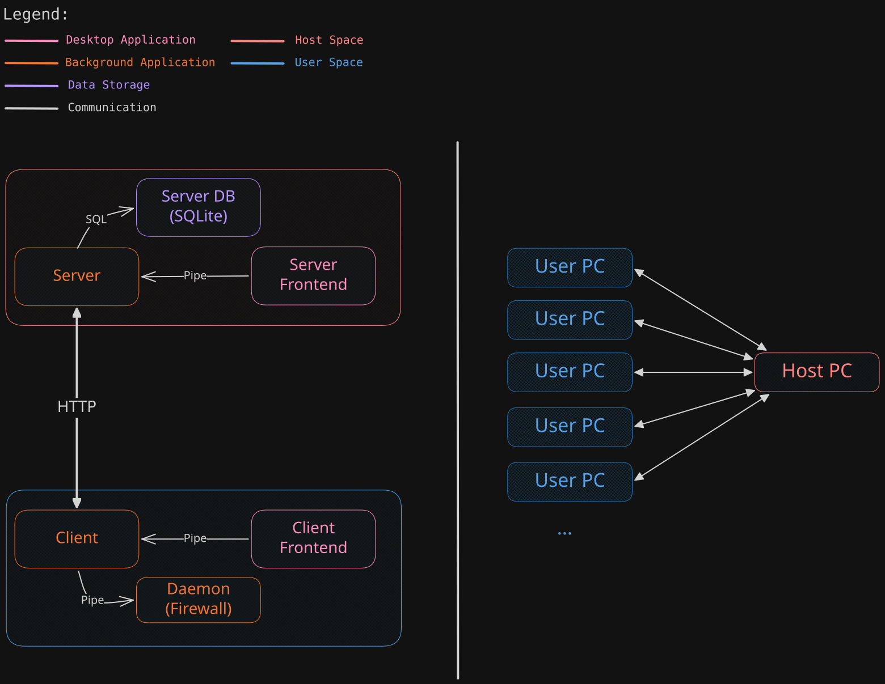

# BigBrother - Distributed Firewall

A Windows kernel-level firewall using WinDivert that filters network traffic based on DNS responses, with centralized whitelist management. Originally designed for classroom environments.

## Architecture



## Components

| Component | Language | Description |
|-----------|----------|------------|
| **Daemon** | C | Windows service with WinDivert firewall |
| **Client Backend** | C | Subprocess spawned by daemon, communicates with server |
| **Server Backend** | Go | Named Pipe server with SQLite database |

## Communication Protocol

### Server <-> Client Backend (Named Pipe)

```
\\<server-ip>\pipe\BigBrother

Commands:
  GET_WHITELIST  => Returns whitelist domains
  REGISTER       => Registers client
  GET_STATUS     => Returns server status
```

### Client Backend <-> Daemon (Local Named Pipe)

```
\\.\pipe\BigBrother Daemon

Commands:
  GET_WHITELIST  => Returns current whitelist
  SET_WHITELIST  => Sets whitelist (domains one per line)
  RELOAD         => Reloads from file
  GET_STATUS     => Returns status
  PING           => Returns OK (for health check)
```

---

## Project Structure

```
BigBrother/
├── daemon/                   # Everything running on client PC
│   ├── firewall/             # Daemon source - main app
│   │   ├── src/
│   │   └── include/
│   ├── client/
│   │   └── backend/          # Background app that communicates with server
│   │       ├── src/
│   │       └── include/
│   └── common/               # Daemon shared code
├── server/                   # Server-side
│   └── backend/              # Manages clients whitelists
└── build.sh                  # Build script
```

---

## Build

```bash
./build.sh [output-dir]
```

Default output directory: `./dist`

**Output files:**
- `firewall-service.exe` - Daemon
- `bb-client.exe` - Client Backend
- `bb-server.exe` - Server Backend
- `WinDivert.dll` - WinDivert runtime

---

## Configuration

Create `E:\bb\config.txt` or adjust paths in source code (they are hardcoded for now):

```
server=<server-ip>
```

**Daemon auto-discovers client binary:** Looks for `bb-client.exe` in the same directory as `firewall-service.exe`.

---

## Domain Whitelist Format

In `whitelist.txt` (one per line):
```
# Comments start with #
google.com   # Exact match
*.github.com # Wildcard suffix
"github"     # Substring match
```

---

## Current Status

### Completed
- DNS packet parsing and domain extraction
- Domain whitelist with pattern matching (exact, wildcard, substring)
- IP allowlist with TTL expiration (minimum 5 min TTL)
- TCP/UDP DNS query handling
- Blocking logic for non-whitelisted destinations
- Local Named Pipe IPC (daemon commands)
- Client Backend subprocess with server communication
- Bidirectional process monitoring (daemon↔client)
- Server Backend with Named Pipe server (Go)
- SQLite database (whitelist, rooms, clients)
- Build script for all components

### Pending
- Server Frontend
- Client Frontend

---

## Future Considerations

1. **Offline mode**: Block all or allow cached whitelist if server unreachable?
2. **Logging**: Event log? File per PC? Sent to server?
3. **Client registration**: Auto-detect room based on network?
