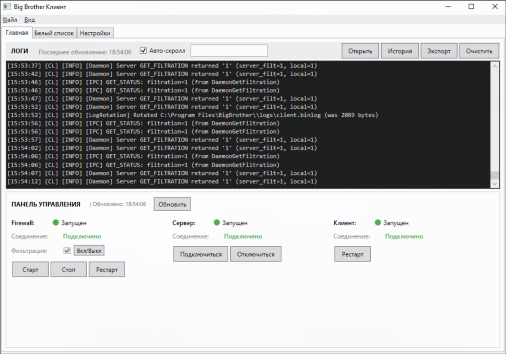
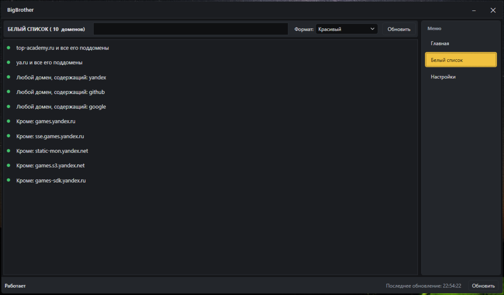
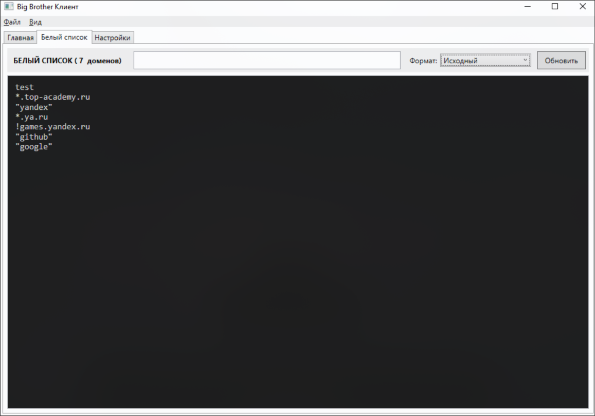
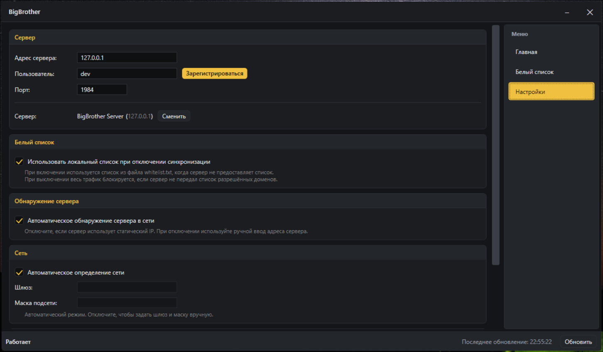
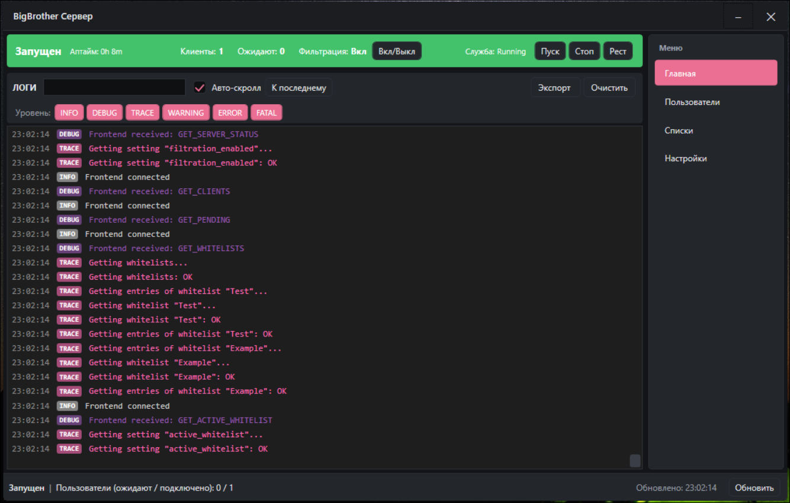
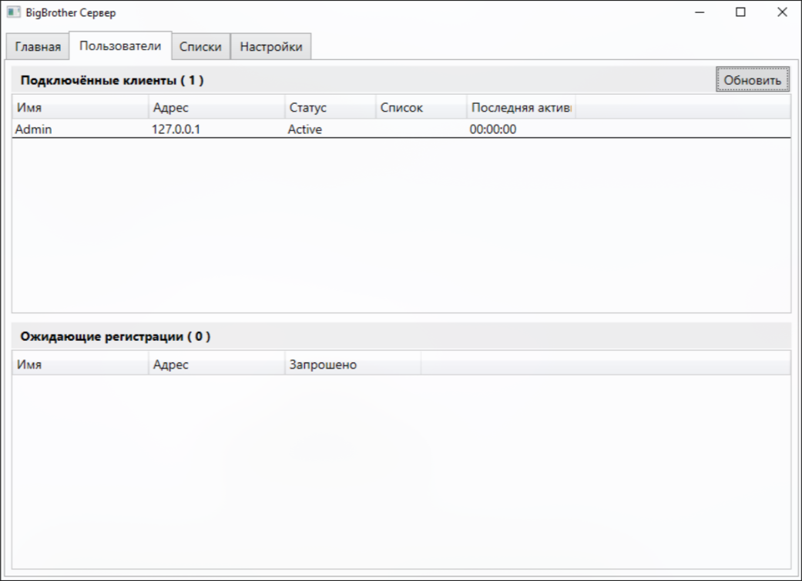
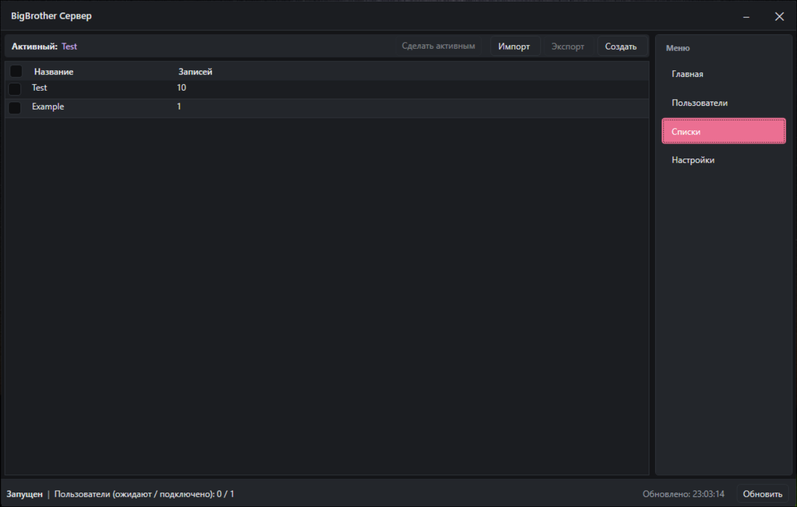
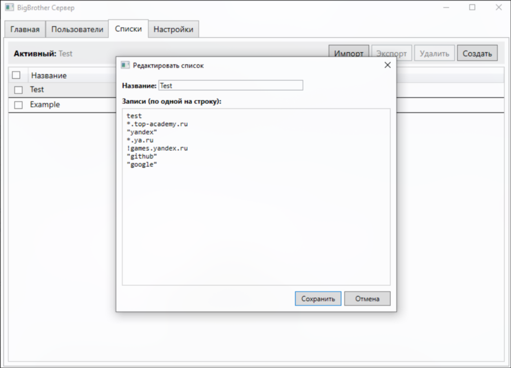
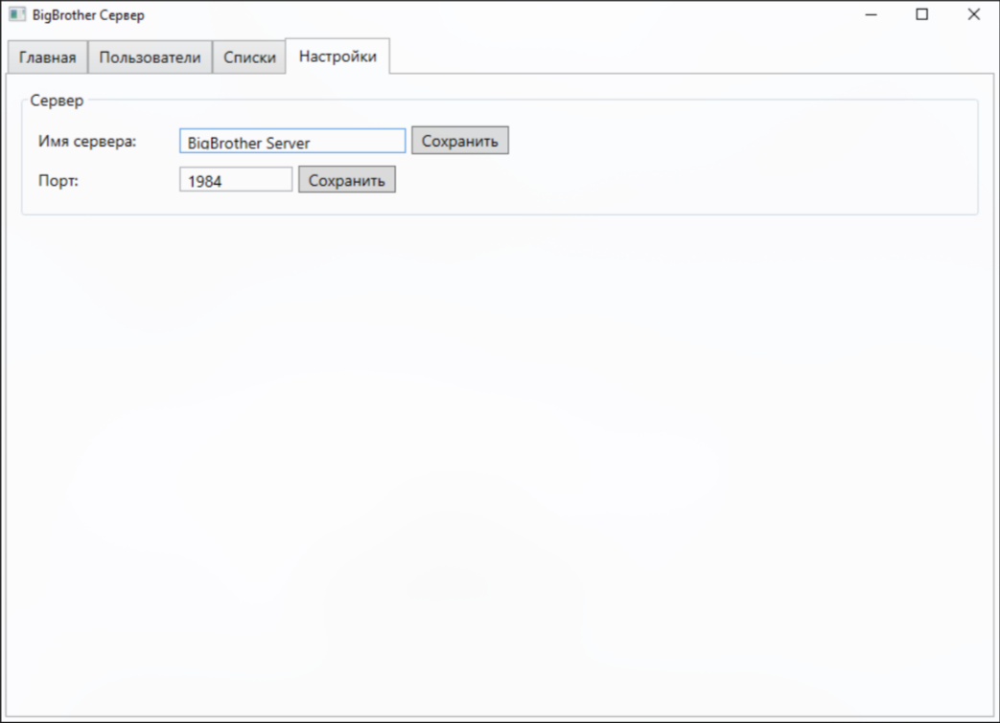

# BigBrother - Пользовательская инструкция

> [!IMPORTANT]
> ЭТА СТРАНИЦА БУДЕТ ОБНОВЛЯТЬСЯ АВТОМАТИЧЕСКИ И СОДЕРЖИТ ИНФОРМАЦИЮ ОТНОСЯЩУЮСЯ К ПОСЛЕДНЕЙ РЕЛИЗНОЙ ВЕРСИИ.

> [!CAUTION]
> В ДАННЫЙ МОМЕНТ ПРОЕКТ НАХОДИТСЯ В БЕТА-ТЕСТЕ.

## СОДЕРЖАНИЕ

- [1. Вступление](#sec-intro)
- [2. BigBrother Client](#sec-client)
  - [2.1 Главная](#sec-client-main)
  - [2.2 Белый список](#sec-client-wl)
  - [2.3 Настройки](#sec-client-settings)
- [3. BigBrother Server](#sec-server)
  - [3.1 Главная](#sec-server-main)
  - [3.2 Пользователи](#sec-server-users)
  - [3.3 Списки](#sec-server-wls)
  - [3.4 Настройки](#sec-server-settings)
- [4. Фильтрация](#sec-filtering)
  - [4.1 Белые списки](#sec-filtering-wl)
  - [4.2 Правила](#sec-filtering-rules)
  - [4.3 Особенности](#sec-filtering-features)
  - [4.4 Как это работает?](#sec-how-it-works)
- [5. Планы развития](#sec-roadmap)

## 1. ВСТУПЛЕНИЕ

**BigBrother** - это распределённый Firewall (межсетевой экран), его основная функция это фильтрация интернет трафика на основе конфигурируемых белых списков. 

> [!CAUTION]
> **Фильтрация не будет работать в сочетании с любым другим приложением, которое как-либо изменяет стандартную маршрутизацию или вмешивается в структуру пакетов.**
> 
> Например: ***Любые Proxy и VPN (В том числе [Cloudflare WARP](https://one.one.one.one)), [Zapret](https://github.com/flowseal/zapret-discord-youtube) и его аналоги.***

> [!CAUTION]
> **Также фильтрация не применяется к локальному трафику, т.е. ко всему входящему/исходящему трафику частных IP адресов определённых в RFC 1918:**
> - Класс А (10.0.0.0 — 10.255.255.255)
> - Класс B (172.16.0.0 — 172.31.255.255)
> - Класс C (192.168.0.0 — 192.168.255.255)
>
> Shared Address Space (100.64.0.0 — 100.127.255.255) определяется в другой спецификации и как следствие является исключением.
>
> P.S. В связи с этой особенность надо проявить осторожность относительно конфигурации ЛВС, - если в ней работает прокси/VPN сервер, через который осуществялется выход в интернет, то при подключении к нему это будет функционировать штатно, в обход фильтрации на клиентском ПК (если на сервере настроена фильтрация, то она при этом будет работать для клиента).  

> [!IMPORTANT]
> **BigBrother** это не одно приложение, а целая система из пяти взаимосвязанных приложений.

Клиентские приложения:

- **BigBrother Firewall** - Основная программа, которая осуществляет **исключительно** фильтрацию трафика. Запускается как служба Windows.

- **BigBrother Client Daemon** - Программа, которая управляет Firewall'ом, через неё происходит взаимодействие с клиентским приложением, связь с сервером и всё прочее, что не связано с фильтрацией трафика. Запускается автоматически Firewall'ом, прекращает работу также автоматически, когда программа определяет, что служба Firewall'а остановилась. 

- **BigBrother Client** - Программа, предоставляющая графический пользовательский интерфейс (GUI) для взаимодействия с предыдущими двумя программами. Запускается как десктопное приложение.

Серверные приложения:

- **BigBrother Server Daemon** - Программа-сервер, используется для централизированного управления белыми списками. Позволяет, управлять подключениями клиентов, добавлять/удалять/редактировать белые списки, правила в них, а также устанавливать активный белый список из числа существующих. Запускается как служба Windows.

- **BigBrother Server** - Программа, предоставляющая графический пользовательский интерфейс (GUI) для взаимодействия с серверным приложением. Запускается как десктопное приложение.

Клиентские приложения устанавливаются на ПК, для которого требуется настроить фильтрацию. Серверные приложения устанавливаются на ПК, который будет выступать в качестве сервера. Установка производится с помощью отдельных установщиков: **BigBrother Client Setup** (клиентская часть) и **BigBrother Server Setup** (серверная часть). **Для того, чтобы система работала, необходимо чтобы сервер и все клиенты были в одной локальной сети.**

Как пользователь/администратор вы будете взаимодействовать напрямую только с двумя программами из этого списка, в основном это будет **BigBrother Server**, т.к. вся фильтрация настраивается на сервере, а клиенты просто синхронизируют свои настройки с ним. Если же потребуется какая-либо доп. настройка или же возникнут проблемы на клиентском ПК, тогда потребуется использовать **BigBrother Client**.

Строго говоря, серверные приложения не являются обязательными для работы **BigBrother**, однако **BigBrother Client** не предоставляет функционала для управления белыми списками и правилами в них. Единственный способ управлять активным белым списком при таком раскладе является настройка, позволяющая использовать белый список из файла **whitelist.txt**, если нет соединения с сервером. В целом, подобный подход стоит рассматривать исключительно как экстренную меру.

Суммируя, можно сказать, что **использовать BigBrother без серверной части не имеет смысла, несмотря на наличие такой возможности.**

## 2. BigBrother Client

### 2.1 Главная

Как было сказанно в вступлении - взаимодействовать вам придётся только с двумя программами, первая из них это **BigBrother Client**, открыть его можно либо через меню **Пуск**, либо через ярлык на рабочем столе (если он не был удалён). При его запуске вы увидите следующее окно:

*Не обращайте внимание на логи, приложение на скриншоте запущено в режиме разработчика.*

В окне есть несколько вкладок, по умолчанию открыта **Главная**, здесь отображаются логи (последние несколько сотен), а главное здесь показаны статусы: Firewall'а, фонового клиентского приложения с которым вы и взаимодействуете через эту программу, а также статус подключения к серверу. 

Также здесь представлены кнопки для управления всем вышеперечисленным. Помимо прочего есть опция, позволяющая остановить фильтрацию без остановки самого Firewall'а. Это полезно, т.к. при остановке Firewall'а фоновое клиентское приложение также остановится автоматически. А поскольку именно к нему мы подключаемся для взаимодействия с системой, то при его остановке у нас не будет возможности настроить клиентскую часть или даже просто просмотреть состояние приложений. 

## 2.2 Белый список

На второй вкладке находится активный белый список.

Есть два формата представления, первый, который используется на скриншоте выше - **Красивый**, он представляет список в человекочитаемом формате, второй - **Исходный** показывает список в исходном формате, к примеру:

В данном случае показаны именно сами исходные правила в белом списке, как они записанны на сервере. 

## 2.3 Настройки

На последней вкладке находятся настройки всей клиентской части.

Тут разберём только блок **Сервер**, т.к. остальное вам вряд ли потребуется, а если и потребуется, это подразумевает, что вы уже знаете для чего предназначены эти настройки.

По порядку:
- **Адрес сервера** - IP адрес сервера к которому вы подключаетесь. Можно настроить вручную, либо автоматически.
- **Пользователь** - Ваше имя для сервера, рекомендуется выставить в соответствии с именем вашего ПК (его можно узнать в Сведениях о системе). 
- **Порт** - Порт, на котором работает сервер по указанному адресу, по умолчанию это 1984.
- **Сервер** - Если вы подключены к серверу, то здесь будет показано его имя и IP адрес (как на скриншоте).

По умолчанию почти все эти поля пустые, если у вас они уже заполнены, то не редактируйте их, если не понимаете что делаете. Чтобы сменить/установить сервер в автоматическом режиме нужно нажать кнопку **Сменить**, нажать надо 1 раз и подождать какое-то время (~5 секунд), далее у вас появится список со всеми найденными серверами, просто выберите один из них. После этого поля **Адрес сервера** и **Порт** изменятся автоматически. Если вы хотите настроить это вручную, то просто измените эти поля руками и нажмите **Сохранить** напротив каждого из них.

После этого, если вы уже зарегистрированы на сервере, то подключение произойдёт автоматически и белый список обновится. Если вы незарегистрированы, то после ввода имени в графу **Пользователь** нужно нажать **Сохранить**, а потом **Зарегистрироваться**. Как только на сервере будет одобрена заявка на регистрацию вы подключитесь автоматически.

В блоке **Фильтрация** есть опция **Авто-отключение при потере связи с сервером**. Если она включена, то при потере соединения с сервером фильтрация на этом клиенте автоматически отключается. Это позволяет избежать ситуации, когда клиент остаётся с последним полученным белым списком и не может получить новые правила. При восстановлении соединения фильтрация включается обратно.

## 3. BigBrother Server

### 3.1 Главная 

Второе приложение, с которым вы будете работать большую часть времени (а если повезёт, то только с ним) это **BigBrother Server**. Именно через него происходит управление белыми списками, при запуске вы увидите следующее окно:

*Не обращайте внимание на логи, приложение на скриншоте запущено в режиме разработчика.*

В окне есть несколько вкладок, по умолчанию открыта **Главная**, здесь отображаются логи (последние несколько сотен), а главное здесь показан статус сервера и службы, кол-во активных клиентов и заявок на регистрацию, а также статус фильтрации и аптайм (время работы) сервера. Помимо прочего здесь представлены кнопки для управления службой и кнопка включения/выключения фильтрации. 

Также как и **BigBrother Client** это приложение является просто интерфейсом к соответствующей программе, поэтому при его выключении вы потеряете доступ к настройкам (т.к. фактически настройки выставляет именно **BigBrother Server Daemon**, вы просто "говорите" ему что сделать, а если он не запущен, то и выставлять настройки некому).

### 3.2 Пользователи

На вкладке **Пользователи** отображаются все подключенные пользователи, а также заявки на регистрацию. Указывается имя пользователя, его IP адрес и статус.

> [!WARNING]
> *Также указывается время последней активности и список, но они по-сути не работают, не обращайте на него внимания. Так как приложение ещё в бета тесте, то могут остаться подобные небольшие недоработки или остатки нереализованных функций. На работу приложения эти колонки никак не влияют.*

Управление пользователями и заявками на регистрацию осуществляется через контекстное меню (открывается кликом ПКМ по записи).

Обновление происходит автоматически с определённым интервалом, также это можно сделать нажав по кнопке **Обновить**.

### 3.3 Списки

На вкладке **Списки** отображаются все белые списки, а также активный белый список. Одновременно только один белый список может быть активным. На этой вкладке имеются кнопки для импорта/экспорта/удаления/создания списков. Управление списками происходит через контекстное меню (ПКМ по записи чтобы открыть) для каждого списка отдельно. 

Если открыть белый список (ПКМ -> Редактировать) то откроется окно в котором можно сменить имя списка, а также все действующие правила.

### 3.4 Настройки

На вкладе **Настройки** находятся настройки сервера. На данный момент там указывается только имя сервера (его видят клиенты), а также порт, на котором работает сервер.

> [!CAUTION]
> **НЕ МЕНЯЙТЕ ПОРТ БЕЗ КРИТИЧЕСКОЙ НЕОБХОДИМОСТИ. ПРИ УСТАНОВКЕ BigBrother ДОБАВЛЯЮТСЯ ПРАВИЛА В БРЭНДМАУЭР WINDOWS, КОТОРЫЕ РАЗРЕШАЮТ ПОДКЛЮЧЕНИЯ ДЛЯ ПОРТА ПО УМОЛЧАНИЮ (1984), ЕСЛИ ИЗМЕНИТЬ ПОРТ, ТО ТАКЖЕ НЕОБХОДИМО ОБНОВИТЬ ЭТИ ПРАВИЛА, ИНАЧЕ КЛИЕНТЫ МОГУТ НЕ ИМЕТЬ ВОЗМОЖЕНОСТИ ПОДКЛЮЧИТЬСЯ К СЕРВЕРУ**

## 4 ФИЛЬТРАЦИЯ

## 4.1 БЕЛЫЕ СПИСКИ

Белые списки состоят из двух частей - имя списка и набора правил в нём (пример на втором скриншоте в разделе 3.3).

Списки можно экспортировать и импортировать в файлы с расширением .wl (например - main.wl). Сами файлы представляют собой набор правил в исходном виде, т.е. это обычный текстовый файл. 

## 4.2 ПРАВИЛА

На данный момент правила позволяют только разрешить или запретить доступ к определённым доменам. Более расширенных функций, по типу разрешения трафика только определённого протокола или разрешение запросов только на конкретный порт в рамках одного адреса отсутствуют, но могут быть добавлены в будущем.

> [!IMPORTANT]
> **Правила записываются по одному на строку.** Т.е. как в примере с **Инверсией** в таблице ниже (через запятую в одному строку) они работать не будут, там это просто перечисление примеров. 

Всего есть 4 правила, они представленны в таблице:

| Правило | Эффект | Синтаксис | Пример | Пояснение |
|-        |-       | -       | -      | -         |
| Домен   | Разрешает доступ к указанному домену | `домен` | figma.com | Будет разрешён доступ только к домену figma.com, но не к его поддоменам |
| Wildcard + Домен | Разрешает доступ к домену и всем его поддоменам | *.`домен` | *.yandex.ru | Будет разрешён доступ к yandex.ru и всем его поддоменам, таким как music.yandex.ru, mc.yandex.ru, games.yandex.ru и т.д. |
| Pattern Matching | Разрешает доступ ко всем доменам, содержащим указанную строку |"`подстрока`"| "github" | Будет разрешён доступ к любому домену, содержащему подстроку github в любой его части |
| Инверсия | Работает в сочетании с другим правилом. При применении инвертирует его эффект. Совместимо со всеми другими правилами | !`правило` | !games.yandex.ru, !*.wikipedia.org, !"google" | Запрещает доступ к домену games.yandex.ru, домену wikipedia.org и всем его поддоменам, любому домену содержащему подстроку google |  

> [!WARNING]
> **Формат поддерживает комменатрии только в файлах при импорте/экспорте**, всё что идёт в строке после `;` или `#` будет проигнорировано, **в самом редакторе внутри приложения это работать не будет, эта строка просто добавиться как правило**.

## 4.3 ОСОБЕННОСТИ (ВАЖНО!)

Во-первых, не стоит часто отключать и включать фильтрацию. На самом деле этого лучше избегать, т.к. для восстановления корректной работы системы потребуется ~5 минут, тоже самое касается и перезапуска Firewall'а в целом.

Это связанно с тем, что Firewall не может обрубить уже установленные системой соединения, технически это, конечно, реализуемо, но во-первых, это всё ещё очень трудно реализовать в адекватном виде т.к. это сильно подвязано к внутренке ОС, а во-вторых, что более важно, - это может привести к существенной потери данных. По этой причине приходится ждать пока эти соединения либо обновятся, либо умрут естественным образом с течением времени.

А что будет происходить в течение этих ~5 минут? Ничего критического (хотя это зависит от конкретного сценария), просто **клиенты будут иметь доступ к ресурсам, которые они открыли во время того как фильтрация была выключена**.

> [!IMPORTANT]
> **Данное поведение не является ошибкой логики или багом и не будет исправлено в будущем.**

Во-вторых, **BigBrother Client** и **BigBrother Server** могу казаться не очень отзывчивыми. Отчасти это связанно с тем что приложение всё ещё в бета тесте и подобное не сильно влияет на работу самого приложение, а только на пользовательский опыт. Поэтому в данный момент акцент не делался на там том, чтобы улучшить эту отзывчивость, но это определённо будет исправлено в первых версиях после полноценного релиза (до версии 2.0). 

## 4.4 КАК ЭТО РАБОТАЕТ? (ДЛЯ АДМИНИСТРАТОРОВ/РАЗРАБОТЧИКОВ)

> [!IMPORTANT]
> **Если вы достаточно квалифицированны, то этот пункт лучше прочесть. Пусть он и не обязателен для того, чтобы разобраться как работать с BigBrother.**

> [!WARNING]
> Данный пункт будет пестрить техническим жаргоном и лексикой, т.к. он описывает принцип работы фильтрации. Этот пункт предназначен только для разработчиков или администраторов, которые хотят глубже изучить принцип работы фильтрации.

### 4.4.1 Firewall

Как было сказано ранее, - за фильтрацию отвечает приложение **BigBrother Firewall**, которое запускается как служба Windows. Сам Firewall написан на языке C и использует библиотеку WinDivert для перехвата пакетов. Это довольно популярная библиотека и она часто используется для подобных приложений где нужно перехватить и/или как-то модифицировать или заблокировать отправку пакетов, её, например, использует популярное приложение для обхода блокировок [Zapret](https://github.com/flowseal/zapret-discord-youtube).

Глобально причин для использования этой библиотеки две:

1) Сам механизм перехвата пакетов должен работать на уровне ядра операционной системы, т.е. это Kernel Driver, а для того чтобы Windows дал его нормально запустить этот драйвер нужно подписать, что стоит от $300 до $600 **в год**. Microsoft оправдывает это защитой от подделок драйверов... несмотря на то что сами регулярно ломают свою ОС. Я думаю тут очевидно, что они просто хотят заработать побольше денег на ровном месте и потакать им в этом нет никакого смысла.

    P.S. Без этой подписи драйвер можно подключить только если запустить Windows в специальном режиме, который отключает проверку подписи загруженных драйверов. Понятное дело, что заниматься этим никто не будет.

2) Реализовать с нуля такой механизм крайне трудно ввиду того, что Windows API — это ад, в который спуститься сложнее и больнее, чем в Ад Данте. А спускаться туда придётся, т.к. любой Kernel Driver работает в самом привилегированном режиме (ring 0) и имеет доступ к железу напрямую, а также разделяет виртуальное пространство адресов с самим ядром ОС — это по сути полноценный модуль ОС. Соответственно, механизмов абстракции там намного меньше и, что более важно, намного меньше механизмов безопасности, из-за чего очень легко вызвать BSOD при ошибке в коде. Добавить сюда тот факт, что это ещё и драйвер, работающий с networking'ом, и сложность возрастает раз в 10. Поэтому лучше использовать уже готовое решение.

Теперь про сам механизм фильтрации.

Очевидно, что на таком низком уровне он может работать только с IP адресами, а не с доменами напрямую. И действительно, внутри для определения того, к каким ресурсам есть доступ, используются IP адреса. Они извлекаются из ответов от DNS серверов. Когда Firewall перехватывает такой ответ, он анализирует то, к какому домену он относится, если он соответствует хоть одному разрешающему правилу в белом списке, то он извлекает из него соответсвующий IP адрес и добавляет его в внутренний список доступа, также извлекается TTL записи и периодически эти записи инвалидируются. 

> [!WARNING]
> При этом для предотвращения ряда ошибок установлен минимальный TTL в 300 секунд, для любых записей с TTL меньше этого значения он будет установлен на 300 секунд. 

В этом механизме есть одна большая проблема - **как определить DNS запрос/ответ?** На самом деле задача на первый взгляд крайне тривиальная - точно известно, что DNS серверы работают на 53 порту по UDP протоколу, это уже всё что нужно знать чтобы перехватить эти запросы, даже не нужно полагаться на Protocol Fingerprinting... Но не всё так просто, проблема в такой штуке **DoH** или же **DNS over HTTPS**.

Проблема с обычным UDP в том, что во-первых, нет шифрования, а во-вторых, нет коррекции ошибок при отправке пакетов, а также их порядок не гарантирован. В этом плане HTTPS, работающий поверх TCP выглядит действительно лучше, даже не смотря на то, что современная сетевая инфраструктура достаточно хорошо развита, чтобы люди начали склонятся в сторону UDP, вместо TCP (HTTP 3.0 с QUIC в пример), но мы отошли от темы. 

Так вот, **DoH** очень сильно портит всю картину. Из-за того что это HTTPS, трафик будет идти по 443 порту, что является одним из самых распространнёным портов в сети, туда летит куча трафика и она далеко не всегда связана с DNS. По итогу нам нужно будет сканировать буквально каждый пакет, который отправляется на 443 порт... мягко говоря идея не очень, так она ещё становится совершенно бессмысленной если добавить тот факт, что всё это дело зашифровано. Даже если мы перехвати пакет, мы просто не знаем приватный ключ, чтобы расшифровать сообщение. На этом этапе у нас буквально нет каких-либо опций.

Очевидно, что это приложение не первое столкнулось с подобной дилеммой. Решение? **DNS Canary Spoof**, передаю слово Gemini:

> [!TIP]
> DNS-карейки (DNS canary domains или Canary domains) — это специально выделенные доменные имена (например, use-application-dns.net), которые браузеры или приложения используют для проверки сетевых настроек. Они выступают в роли «канареек в шахте», предупреждая систему о том, как нужно маршрутизировать или шифровать трафик.

Спасибо, Gemini. Как это работает? Очень просто - перед активацией **DoH** браузер пытается зарезолвить специальный домен (use-application-dns.net) используя незашифрованный локальный DNS сервер. Если этот локальный DNS сервер возвращает конкретный негативный ответ, браузер интерпретирует это как сигнал, чтобы использовать стандартный DNS, т.е. просто гонять трафик в обход **DoH**, даже если он включен в настройках браузера.

Именно это используется для обхода проблемы с **DoH**. 

> [!CAUTION]
> На данный момент это было проверенно только в Google Chrome и Mozilla Firefox, там всё работает отлично. Но по идеи это должно работать и с любыми другими браузерами, которые используют их движки (V8 и Gecko). Однако разработчики могли что-то намудрить, поэтому 100% гарантий нет.

### 4.4.2 Frontend приложения

**BigBrother Client** и **BigBrother Server** по большому счёту были завайбкожены, я не очень силён в C#, с WPF конечно был небольшой опыт, но разбираться с +- новым языком и гигнатским фреймворком у меня нет и не было желания и времени. Оно работает - и ладно, в главе 5 я указал, что есть идея к версии 3.0.0 переписать их на Tauri, но если получиться их пофиксить до этого времени, то врядли я буду этим заниматься. Это чисто frontend, ничего такого в том чтобы срезать тут углы я не вижу. 

P.S. Я пару раз смотрел в код и меня, честно, в холодный пот бросило от того, что там было нагенерировано и каким образом оно вообще работает. Надеюсь силами молитв хотя бы до 2.0.0 оно дожить сможет, слава Омниссии.

### 4.4.3 Клиент-Сервер

Клиент-серверное взаимодействие происходит через TCP, вся синхронизация почти везде выполнена за счёт периодических запросов (polling), из-за этого местами страдает отзывчивость, особенно на фронте. После релиза 1.0.0 это будет исправляться.

## 5 ПЛАНЫ РАЗВИТИЯ НА БУДУЩЕЕ (ROADMAP)

- **Версия 1.0.0 (Мы здесь, но пока в бете)** - Первый полноценный production релиз. Реализация всего базового функционала.
  
- **Версии 1.x.x** - Будут направлены на улучшение и доработку приложений + добавление новых фичей, а также на реорганизацию кодовой базы и оптимизацию в целом.
  
- **Версия 2.0.0** - Доработка безопасности. Включает в себя добавление шифрования сообщений при обемене данными между приложениями по IPC или при общении клиента с сервером. 
  
  На этом этапе приложение будет готово к массовому использованию в продакшене, до этого его лучше использовать только в сценариях с низкими требованиями к ИБ.

- **Версии 2.x.x** - Будут приоритетно направленны всё также на доработку безопасности, а уже после этого на добавление новых функций или рефакторинг.
  
- **Версия 3.0.0** - На этой стадии каких-либо чётких планов нет, есть только идеи того, что можно сделать. На данный момент рассматривается вариант с переписыванием Frontend приложений на Tauri, однако эта очень спорная идея и далеко не факт, что она будет реализована.